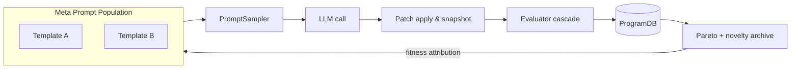

# OpenEvolve

OpenEvolve is a research-oriented framework that explores large-language-model-driven evolutionary programming.  
The system focuses on evolving algorithmic building blocks inside explicit `EVOLVE` regions of source files.  
It combines structured prompting, diff-based editing, multi-stage evaluation cascades, and Pareto-guided search to 
progressively improve candidate programs.

## Features

- **LLM guided evolution** – structured prompts request SEARCH/REPLACE diffs that are applied to annotated blocks.
- **Configurable model endpoint** – works with OpenAI hosted models as well as local deployments (vLLM, Ollama, LM Studio) via an OpenAI-compatible REST interface.
- **Cascaded evaluation** – tasks may expose multiple evaluation stages to filter candidates with fast checks before expensive scoring.
- **Pareto dominance and novelty** – selection balances multi-objective optimization with behavioural diversity.
- **Safety aware sandbox** – candidate programs execute in a constrained subprocess with limited resources.
- **Plugin-style tasks** – new optimisation problems can be added under the `tasks/` directory.

## Installation

```bash
python -m venv .venv
source .venv/bin/activate
pip install -e .
```

## Quickstart

OpenEvolve ships with a CLI that orchestrates the new persistent evolution engine. The
default configuration uses a deterministic echo "LLM" so you can experiment without
network access or API keys.

```bash
pip install -e .
openevolve init-db --db .openevolve/openevolve.db
openevolve run --config configs/demo_math.yml --run-id demo
```

The command above will evolve the toy sum-of-squares task for two generations, logging
artifacts under `runs/demo/`. Inspect the resulting candidates and metrics:

```bash
openevolve inspect --run-id demo --top 5
openevolve export-archive --run-id demo --out artifacts/demo.json
```

To continue a previous run, reuse the same run identifier:

```bash
openevolve resume --run-id demo
```

If you want the CLI to stream a static diff rather than mutating code, set
`llm.mode: echo` with a `response` string in the YAML configuration. Switching to a real
provider only requires adding credentials via `OpenEvolveSettings` environment variables
and updating the `llm` section. Use `llm.mode: openai` to call any OpenAI-compatible
endpoint (including local deployments) and optionally supply `base_url`, `api_key`, and
`model` overrides directly in the YAML file.

### Evolution loop overview



## Core components

- **ProgramDB (`openevolve.db`)** – stores runs, candidates, meta-prompts, and evaluation
  history in SQLite. The schema is automatically created on first use and supports
  inspection from the CLI.
- **PromptSampler (`openevolve.prompt_sampler`)** – assembles long-context prompts that mix
  elites, novelty exemplars, and recent failures while respecting token budgets.
- **Meta-prompt evolution (`openevolve.meta_prompt`)** – maintains a small population of
  instruction templates that co-evolve with program candidates and receive fitness
  updates based on downstream performance.
- **Evaluator cascade (`openevolve.evaluators`)** – runs pluggable evaluators in parallel
  with timeouts, retries, and optional early cancellation on failure.
- **Selection & archive (`openevolve.selection`)** – implements Pareto ranking, novelty
  search, and candidate ageing. The archive exposes mixture sampling for future
  generations.
- **Apply engine (`openevolve.apply`)** – safely applies JSON or unified diffs to EVOLVE
  blocks or whole files with automatic revert on failure.
- **Visualization (`openevolve.viz`)** – produces Pareto scatter plots given a run ID. The
  dependency on `matplotlib` is optional and only required when plotting.

## Running with a model endpoint

Set your API credentials (or point to a local OpenAI-compatible deployment) and start the
legacy controller for backwards compatibility:

```bash
export OPENAI_BASE_URL=http://localhost:8000/v1
export OPENAI_API_KEY=sk-your-token
python scripts/run_controller.py --task speed_sort
```

The new engine exposes the same functionality via the CLI – set
`llm.mode: noop` and supply a callable when embedding the engine inside another
application. To point at a hosted or local OpenAI-compatible endpoint directly from YAML,
add a block like the following:

```yaml
llm:
  mode: "openai"
  api_key: "sk-your-token"
  base_url: "http://localhost:8000/v1"
  model: "gpt-4.1-mini"
  temperature: 0.6
```

## Configuration reference

Environment variables follow the naming convention used by `pydantic` settings. The most
relevant options are:

| Variable | Description | Default |
| --- | --- | --- |
| `OPENAI_API_KEY` | API key for remote model providers. | `None` |
| `OPENAI_BASE_URL` | Base URL for the REST API. | `https://api.openai.com/v1` |
| `OPENEVOLVE_MODEL_PRIMARY` | Primary model identifier. | `gpt-4.1` |
| `OPENEVOLVE_MODEL_SECONDARY` | Optional secondary model for ensembles. | `gpt-4o-mini` |

Additional knobs such as concurrency and novelty thresholds can be found in
`openevolve.config.OpenEvolveSettings`.

The YAML configuration loader (`openevolve.config.load_config`) understands the options in
`configs/default.yml`. Key sections include:

- `task`: description and target file to mutate (relative to the configured workdir).
- `sampler`: prompt assembly parameters such as token budget and context counts.
- `cascade`: evaluator definitions and parallelism controls.
- `meta_prompt`: population size and mutation probability for meta-instructions.
- `archive`: capacity and novelty neighbourhood size.
- `evolution`: patch scope (`blocks` or `wholefile`) and safe revert behaviour.

## Tasks

Three demonstration tasks ship with the repository:

- `toy_sum_squares` – evolve a simple numerical routine.
- `speed_sort` – target faster array sorting heuristics.
- `algorithmic_optimization` – mutate a bubble-sort baseline toward faster insertion-style
  heuristics while balancing runtime and brevity.

Each task exposes an `evaluate` function returning a dictionary of metrics and can be
extended with additional tests. The new `configs/algorithmic_optimization.yml` profile
demonstrates a multi-objective Pareto run. For a quick standalone comparison without the
full engine, run `python examples/algorithmic_optimization.py` to see how the metrics shift
between the baseline bubble sort and an insertion-sort variant.

## Testing

Run the formatting, linting, and test suite:

```bash
ruff check src tests
black src tests
mypy src
pytest
```

The new unit tests cover the ProgramDB, selection utilities, prompt sampler, meta-prompt
updates, and an end-to-end smoke test for the async evolution engine. All tests run with a
deterministic fake LLM so they do not require network access.

## Development

Run the formatting, linting, and test suite:

```bash
ruff check src tests
black src tests
mypy src
pytest
```

## License

The project is distributed under the terms of the MIT License.
